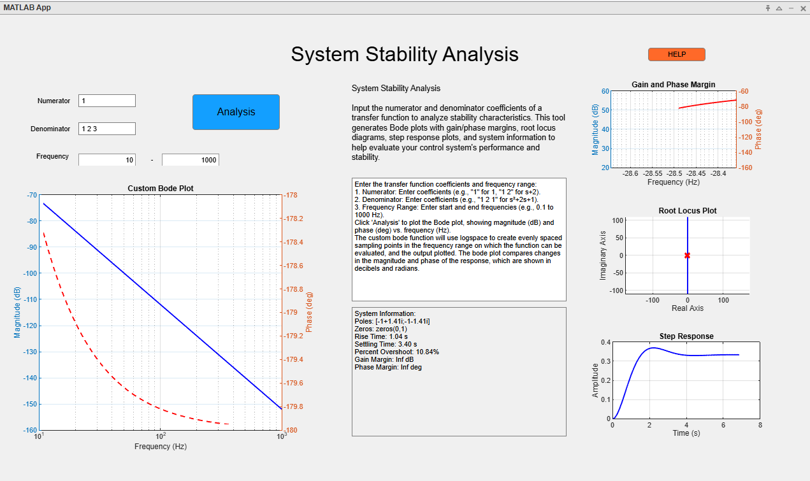

## System Stability Analysis

### Objective
The goal of this project is to develop a MATLAB-based graphical user interface (GUI) tool that allows users to input the numerator and denominator coefficients of a system's transfer function and analyze its stability. The tool displays the Bode Plot, Gain and Phase Margins, Root Locus, System Information, and Step Response for the given system.

### System Stability
A linear time-invariant (LTI) system is stable if its output remains bounded for any bounded input. This is known as Bounded Input, Bounded Output (BIBO) stability.

A transfer function \( H(s) = \frac{Y(s)}{X(s)} = \frac{b_0 s^m + \dots + b_m}{a_0 s^n + \dots + a_n} \) represents the relationship between input and output in the Laplace domain. The **poles** of this function (values of \( s \) that make the denominator zero) determine system stability:
- For **continuous-time systems**, stability requires all poles to lie in the **left half of the complex plane** (i.e., real parts < 0).
- For **discrete-time systems**, stability requires all poles to lie **inside the unit circle** in the complex plane.

A **Bode plot** shows the frequency response of a system (magnitude and phase vs. frequency). The Bode plot doesn’t explicitly show if a system is unstable, but it shows signs of stability if no gain spikes at high frequency (i.e., magnitude does not shoot up) and the phase margin and gain margin are positive.

### Mathematical Functions

#### Bode Plot
The Bode plot is a key tool in control systems engineering used to analyze a system's frequency response. It consists of two plots:
- **Magnitude plot**: Gain (in dB) vs. frequency.
- **Phase plot**: Phase shift (in degrees) vs. frequency.
##### Manually Creating Bode Plot
**Input Collection**:
Users enter the numerator and denominator of the transfer function, such as `numerator = [1 1]`, `denominator = [1 2 1]`, representing \( H(s) = \frac{s + 1}{s^2 + 2s + 1} \), and specify a frequency range.

The frequency range is validated to ensure the lower bound is positive and the upper bound is greater than the lower bound, supporting non-integer frequencies.

**Frequency Sampling**:
To create a smooth Bode plot across a wide frequency range, the application uses MATLAB’s logspace function to generate 100 logarithmically spaced frequency points between the user-specified lower and upper bounds (e.g., logspace(log10(0.1), log10(1000), 100)).The use of logspace ensures that the frequency range is sampled logarithmically, allowing the system to handle non-integer frequencies. This is important because it provides denser sampling at lower frequencies and sparser sampling at higher frequencies, which provides is more effective than a linear scale.

**Transfer Function Evaluation**:
The transfer function is created using MATLAB’s `tf()` function. At each frequency \( \omega_i = 2\pi f_i \), it evaluates \( H(j\omega_i) \) using `evalfr(H, j*omega_i)`.

**Magnitude and Phase Calculation**:
- Magnitude is calculated as \( |H(j\omega)| = \sqrt{\text{Re}(H)^2 + \text{Im}(H)^2} \) and converted to dB.
- Phase is calculated as \( \angle H(j\omega) = \tan^{-1}(\text{Im}(H)/\text{Re}(H)) \), then converted to degrees.

**Plotting**:
The Bode plot is typically shown on a dual yy-axis, where the left y-axis plots the magnitude (in dB) versus frequency (in Hz) and the right y-axis plots the phase (in degrees) versus frequency. 

The Bode plot is useful because it shows the system’s frequency response. the magnitude Plot shows how the system amplifies the input signal at different frequencies. the Phase Plot Indicates the phase shift introduced by the system. Manually calculating magnitude and phase provides a clearer understanding of how transfer functions behave in the frequency domain, which is essential for designing and analyzing control systems.

#### Gain and Phase Margin
- **Gain Margin**: The increase in gain (in dB) the system can tolerate before becoming unstable.
- **Phase Margin**: The additional phase lag (in degrees) that can be introduced before the system becomes unstable.

These margins indicate the robustness (how much the gain and phase can change as a percentage before the system becomes unstable). Although MATLAB's built-in `margin()` function is used, values are derived from the custom frequency response.

#### Root Locus
The Root Locus is a graphical representation showing how the poles of a closed-loop system's transfer function change as a parameter (like gain) varies. The output is a plot of the poles of the closed-loop system for different values of the gain K.

- **Poles**: Values of \( s \) that make the denominator zero.
- **Zeros**: Values of \( s \) that make the numerator zero.
- **Open-Loop Function**: Root locus starts from the open-loop transfer function \( G(s)H(s) \).
- **Closed-Loop Poles**: Determined by the characteristic equation.
- **Plot**: Visualizes pole movement as gain \( K \) varies from 0 to \( \infty \).
- **Stability**: System is stable if all poles remain in the left half-plane.

#### Step Response
The step response shows how the system reacts to a sudden change in input, such as from the off to on state. In matlab, step() is the response of dynamic system. It computes the step response to a step change in input value from U to U + dU after td time units. It provides time-domain characteristics such as:
- Speed of response
- Overshoot
- Steady-state behavior

#### System Info
- System info shows information about the system derived from the step response of the system, output in a text format. The information includes the 
-Poles: Poles are the values of sss that make the denominator of a system's transfer function zero, and they determine system stability and dynamic behavior.
- Zeros: Zeros are the values of sss that make the numerator of a transfer function zero, shaping the system’s frequency response and transient characteristics.
- Rise Time: Rise time is the time it takes for a system’s step response to go from 10% to 90% of its final value.
- Settling Time: Settling time is the time required for the system's response to remain within a specific tolerance band (commonly ±2%) around the final value.
- Percent Overshoot: Percent overshoot is the amount the response exceeds the final value, expressed as a percentage of that final value.
- Gain Margin: Gain margin is the amount by which the system gain can be increased before the system becomes unstable, measured in decibels (dB).
- Phase Margin: Phase margin is the additional phase lag required to bring the system to the verge of instability at the gain crossover frequency, measured in degrees

### GUI Layout and Code

#### User Inputs
- **Numerator & Denominator**: The user can input the numerator and denominator using MATLAB-style syntax (e.g., `[1 2 3]` for \( s^2 + 2s + 3 \)).
- **Frequency Range**: Must be numeric; low frequency < high frequency.

#### GUI Components
- **Analysis Button**: Begins the analysis process.
- **Bode Plot**: Displays the Bode plot.
- **Bode Plot Info**: Gives users a short explanation of the purpose of a bode plot, and  instructions on how to use the application. For more information, users can click the HELP button at the uper right corner of the app.
- **System Info Box**: Shows calculated poles, zeros, and time-domain parameters.
- **Gain and Phase Analysis**: Graphically displays gain and phase margins.
- **Root Locus Section**: Displays zero-pole movement.
- **Step Response Section**: Visualizes time-domain response.
- **Help Button**: Links to the GitHub repository for documentation and source code.

### Key Functions

- **AnalysisButtonPushed**: Collects input values, checks for errors, and starts system analysis. If there is an error processing the input, an error message will be displayed and the program will stop. If the system is unstable, an error message will be displayed and the program will stop.
- **HELPButtonPushed**: Redirects to the project GitHub page.
- **createTransferFunction**: Builds the transfer function from inputs and validates format. Will return an error if numerator, denominator, or frequency range inputs are invalid. Other parsing errors will throw a generic error.
- **customBode**: Generates custom Bode data. See BODE.
- **plotCustomBode**, **plotGainPhase**, **plotRootLocus**, **displayStepResponse**: Plot respective components.

### App Properties
- **tf_sys**: Transfer function object created from user inputs. Transfer function will not be created if inputs are invalid.
- **freq**: Array holding the user-defined frequency range.
